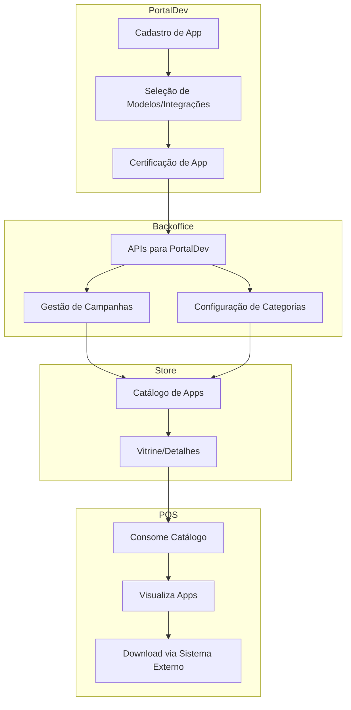

# Visão Geral da Arquitetura

Este documento descreve a arquitetura modular do sistema de loja de aplicativos para POS, incluindo os principais módulos e o fluxo de informações entre eles.

## Módulos Principais

### 1. Portal Dev
- Responsável pelo cadastro, certificação e aprovação de aplicativos.
- Orquestra o fluxo de validação até a aprovação final.
- Após aprovação, consome APIs do Backoffice para subir informações dos apps aprovados.

### 2. Backoffice
- Operado pelo time da loja.
- Permite cadastro de campanhas de marketing, configurações de categorias, gestão de aplicativos e outras funções administrativas.
- Expõe APIs para integração com o Portal Dev e outros sistemas.

### 3. Store
- Consumido pelos terminais POS.
- Exibe o catálogo de aplicativos, informações descritivas e vitrine da loja.
- Não realiza o download dos aplicativos diretamente; o download é feito por outro sistema especializado.

## Fluxo de Informações

1. **Cadastro e Certificação:**
   - O desenvolvedor cadastra o app no Portal Dev.
   - O app passa por processos de certificação e aprovação.
2. **Publicação:**
   - Após aprovação, o Portal Dev envia os dados do app para o Backoffice via API.
3. **Operação da Loja:**
   - O time da loja usa o Backoffice para configurar campanhas, categorias e gerenciar apps.
4. **Consumo pelo POS:**
   - O terminal POS acessa o Store para visualizar o catálogo e detalhes dos apps.
   - O download do app é realizado por outro sistema, não pelo Store.

## Jornada de Cadastro e Certificação de Aplicativos

### Cadastro do Aplicativo
- O desenvolvedor inicia o cadastro do app no Portal Dev.
- Informa configurações comuns do aplicativo (nome, descrição, categoria, etc).
- Seleciona os modelos de terminais POS suportados e as integrações (libs de pagamento) disponíveis na loja.
- Em um único pedido de cadastro, pode solicitar múltiplas configurações (ex: diferentes modelos de POS e integrações) para futura certificação.

### Certificação do Aplicativo
- O desenvolvedor faz upload do pacote do app para certificação.
- O sistema utiliza informações do manifest do app para localizar os cadastros aprovados e permitir que o dev escolha qual configuração deseja certificar.
- O processo de certificação é realizado para cada configuração/modelo/integração selecionada.

## Observações Adicionais
- Cada app pode ser certificado para múltiplos modelos de POS e integrações, facilitando a compatibilidade e expansão do catálogo.
- O fluxo é flexível, permitindo que o desenvolvedor gerencie múltiplas jornadas de cadastro e certificação conforme necessidade.
- As informações de modelos e integrações ficam centralizadas na loja, garantindo padronização e controle.

## Observações
- Cada módulo é independente e pode ser escalado separadamente.
- A comunicação entre módulos ocorre via APIs bem definidas.
- O sistema é preparado para evoluir, permitindo integração de novos módulos ou serviços conforme necessário.

## Diagrama Visual da Arquitetura

---
Esse diagrama mostra o fluxo principal entre os módulos: Portal Dev, Backoffice, Store e POS, incluindo as etapas de cadastro, certificação, gestão e consumo dos aplicativos.
Se quiser diagramas mais detalhados ou específicos, posso complementar!
