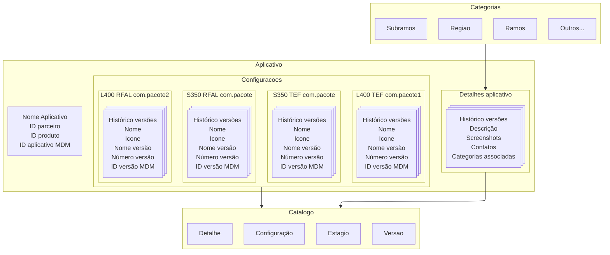

# Jornadas onde o a Loja de aplicativo participa

## Cadastro do aplicativo

1. O desenvolvedor via portal dev solicita o cadastro do aplicativo enviando:
   - Nome do aplicativo
   - Conjunto de configuracoes (array)
     - tipo de integracao (obtido desta loja)
     - modelo de terminal (obtido desta loja)
     - nome do pacote android
   - Categorias
     - Regiões de atuação   
     - Ramos de atividade
     - Subramos de atividade
   - Contato de suporte do aplicativo
     - Nome
     - Email
     - Site
     - Telefone
     - Horarios de atendimento
       - seg-sex: 9h às 18h
       - sab: 10h às 14h
   - Detalhes da Vitrine
     - Imagens do aplicativo (array, sha256 e mime type da imagem)
     - Descrição detalhada
     - Categorias
     - Palavras-chave

2. Uma vez o cadastro submetido, caso o sistema detecte imagens ausentes no cadastro, ele deve na resposta indicar quais imagens estão faltando através de urls de upload.

3. O portal dev deve fazer o upload as imagens solicitadas.

4. Uma vez todas as pendencias de upload resolvidas o cadastro é disponibilizado em dispositivos configurados no perfil de revisão.

5. Uma vez aceito o cadastro o mesmo é ativado para ser exibido na loja de aplicativos no perfil produtivo em todas as configurações associadas ao aplicativo.

### Informações adicionais

O cadastro é composto quatro itens autalizáveis: Configuração, Categorias, Contato e Detalhes da Vitrine.

As solicitações de cadastro e atualização são sempre feitas via POST, gerando um novo registro a cada envio. Dados como contato, detalhes do aplicativo e categorias são referenciados se forem idênticos aos já existentes; caso contrário, um novo registro é criado. Esse padrão garante histórico, rastreabilidade e integridade dos dados, facilitando auditoria e evitando inconsistências por atualizações parciais.

Imagens enviadas devem ser validadas quanto ao tipo e hash antes de serem aceitas. O sistema rejeita dados inconsistentes ou incompletos, mesmo que o frontend valide. Registros antigos não são removidos, apenas deixam de ser referenciados quando há atualização, mantendo o histórico completo e caso as imagens sejam solicitadas novamente no cadastro o sistema pode ainda reutilizá-las caso ainda esteja disponível.

- **Configuração:** determina quais conjuntos de Tipo de integração (obtido desta loja) e Modelo de terminal (obtido desta loja) são aplicáveis ao aplicativo para certificação.
- **Categorias**: define as áreas de atuação do aplicativo, ramos e subramos de atuação, permitindo que ele seja encontrado mais facilmente por usuários interessados.
- **Contato**: informações de contato do desenvolvedor, incluindo nome, e-mail, telefone e horários de atendimento.
- **Detalhes da Vitrine**: informações adicionais sobre o aplicativo, como imagens, descrição e palavras-chave.

> Para um aplicativo ser certificado, é necessário que ele possua as configurações aprovadas.
> Para um aplicativo ser exibido na loja pública é necessário que ele reenvie categorias, contato e detalhes da vitrine para validação e posterior aprovação.
> O envio do cadastro precisa ser feito de forma completa e o sistema não permitirá o envio de um cadastro incompleto.

## Cadastro de versão certificada do aplicativo
1. Após a certificação do aplicativo pelo portal dev, as informações da versão certificada são enviadas para a loja de aplicativos:
  - Configuração do aplicativo usada na certificação (deve estar aprovada na loja)
  - Ícone do aplicativo (extraído do APK) — hash, mime type
  - Nome do aplicativo (extraído do APK)
  - Nome e número da versão (extraídos do APK)
  - Tamanho do aplicativo
2. A loja de aplicativos valida:
  - Se a configuração recebida está aprovada e corresponde ao cadastro.
  - Se os dados extraídos do APK (nome, versão, ícone, hash, mime type, tamanho) estão corretos e completos.
  - Se as imagens recebidas estão corretas (tipo, hash, formato).
3. Caso alguma imagem esteja faltando, a loja retorna URLs de upload para o portal dev.
4. O portal dev envia as imagens para as URLs fornecidas.
5. A loja atualiza o cadastro do aplicativo com a versão certificada e mantém o histórico de versões.
6. Se houver dados inconsistentes ou incompletos, a loja rejeita a atualização e informa o portal dev sobre o motivo.

## Responsabilidades da loja de aplicativos

**A loja de aplicativos é sensibilizada e atua nos seguintes cenários:**

- **Publicação em loja pública:**
  - Valida e aprova dados obrigatórios (categorias, contato, detalhes da vitrine, configurações).
  - Ativa o aplicativo para exibição ao público geral.
  - Mantém histórico, rastreabilidade e auditoria das versões e aprovações.
  - Gera URLs de upload para imagens faltantes e valida arquivos recebidos.
  - Rejeita cadastros ou atualizações incompletas, informando o portal dev sobre pendências.

- **Distribuição privada (via parceiro/MDM):**
  - Não exige dados de categorias, contato ou vitrine, pois o relacionamento é direto entre parceiro e cliente.
  - Não valida ou aprova dados para exibição pública.
  - Mantém registro das ações para auditoria, se necessário.
  - Não interfere na distribuição, apenas recebe notificações ou registros, se previsto.

**Resumo:**
A loja só exige e valida dados obrigatórios quando o aplicativo for publicado para o público geral. Na distribuição privada, a loja não interfere no relacionamento, suporte ou ativação, pois essas responsabilidades são do parceiro. O sistema garante que, ao migrar para a loja pública, todos os requisitos sejam atendidos e aprovados pelos times responsáveis.

## Cadastro de dispositivos para revisão (time loja de aplicativos)
1. O time da loja de aplicativos acessa o backoffice da loja e efetua o cadastro dos dispositivos com permissao para visualizar os aplicativos em revisao.
2. Uma vez cadastrado todos os cadastros no estágio de revisão serão visíveis para os dispositivos autorizados.

## Cadastro de dispositivos para piloto (solicitação do desenvolvedor via portal dev)
1. O desenvolvedor solicita o cadastro de dispositivos para o piloto através do portal dev.
2. O time da loja de aplicativos avalia a solicitação e realiza o cadastro dos dispositivos autorizados.
3. Os dispositivos cadastrados para o piloto terão acesso aos aplicativos em fase de teste.

## Distribuição de versão de aplicativos em piloto
1. O desenvolvedor via portal dev escolhe um dos aplicativos certificados para pilotar em loja pública.
2. O portal dev envia a solicitação para a loja pública e está aponta a versão do aplicativo para o estágio de piloto.
3. Os dispositivos cadastrados para o piloto recebem acesso ao aplicativo e podem fazer o piloto.

## Distribuição de versão de aplicativos em produção
1. Após o término do piloto e o mesmo aprovado, o desenvolvedor pode solicitar a distribuição da versão do aplicativo para a loja pública.
2. O portal dev envia a solicitação para a loja pública e esta aponta a versão do aplicativo para o estágio de produção.
3. A versão do aplicativo é disponibilizada para todos os usuários na loja pública.

