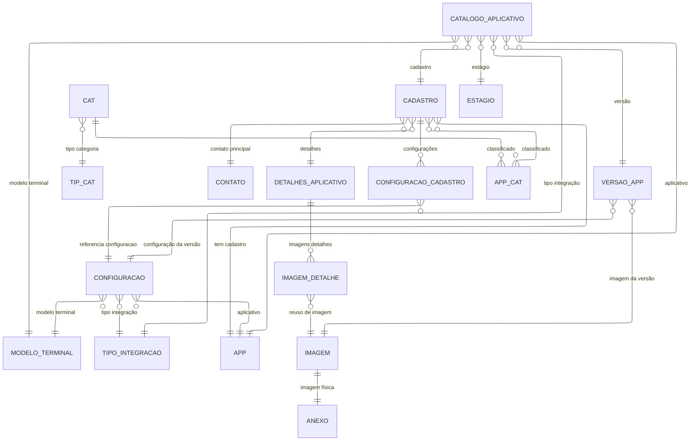

# Modelagem de Dados (Mermaid)

## Legenda
## Legenda
- APP: Aplicativo
- CADASTRO: Registro histórico do aplicativo, vinculado a contato e detalhes
- CONTATO: Dados de contato principal do cadastro
- DETALHES_APLICATIVO: Informações detalhadas do aplicativo (conteúdo, screenshots)
- IMAGEM_DETALHE: Associação entre detalhes do aplicativo e imagens reutilizáveis
- IMAGEM: Representação lógica da imagem
- ANEXO: Arquivo físico vinculado à imagem (1:1)
- CONFIGURACAO_CADASTRO: Associação entre cadastro e configuração técnica
- CONFIGURACAO: Configuração técnica do aplicativo (modelo, integração, app)
- MODELO_TERMINAL: Tipo/modelo de terminal suportado
- TIPO_INTEGRACAO: Tipo de integração suportada
- VERSAO_APP: Versão do aplicativo, vinculada à configuração e imagem
- CATALOGO_APLICATIVO: Exposição/ativação do aplicativo por estágio, versão, modelo, integração e cadastro
- ESTAGIO: Estágio do catálogo (ex: homologação, produção)
- APP_CAT: Associação muitos-para-muitos entre aplicativo e categoria
- CAT: Categoria do aplicativo
- TIP_CAT: Tipo de categoria

> Diagrama gerado automaticamente por GitHub Copilot.

## Requisitos
1. Catalogo de aplicativos deve ter combinação (modelo terminal, tipo integração, estágio e aplicativo) únicos.
2. Configuração de aplicativos deve ter combinação (modelo terminal, tipo integração e aplicativo) únicos.
3. O cadastro de aplicativos de ter reúso dos contatos, detalhes dos aplicativos, caso não sejam alterados.
4. Os anexos e imagens devem ter reúso entre todas as entidades.
