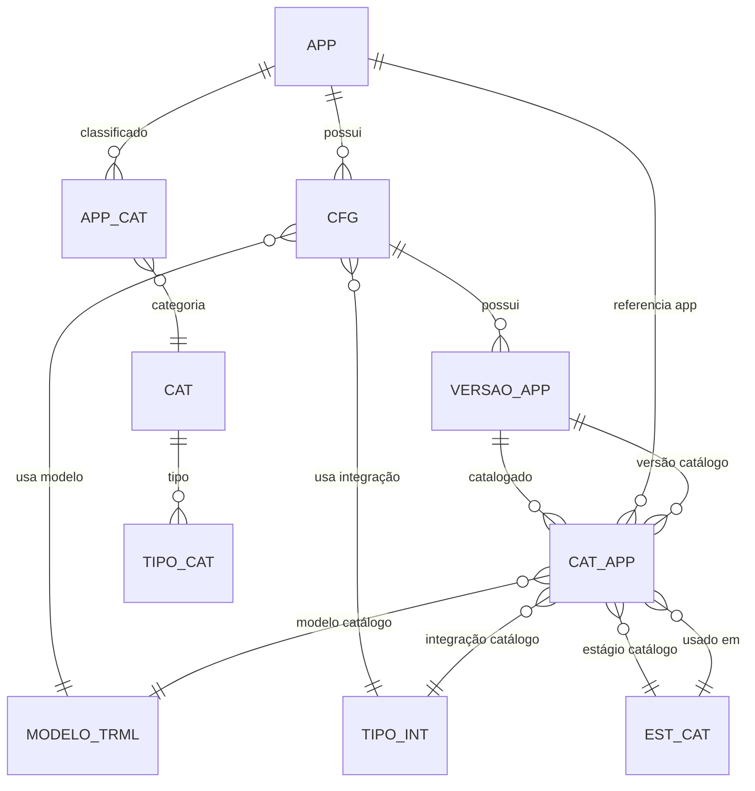

# Modelagem de Dados (Mermaid)

## Legenda
- APP: Aplicativo
- CFG: Configuração
- VERSAO_APP: Versão do Aplicativo
- APP_CAT: Associação App-Categoria
- CAT: Categoria
- MODELO_TRML: Modelo de Terminal
- TIPO_INT: Tipo de Integração
- CAT_APP: Catálogo de Aplicativo
- EST_CAT: Estágio do Catálogo
- TIPO_CAT: Tipo de Categoria

> Diagrama gerado automaticamente por GitHub Copilot.
